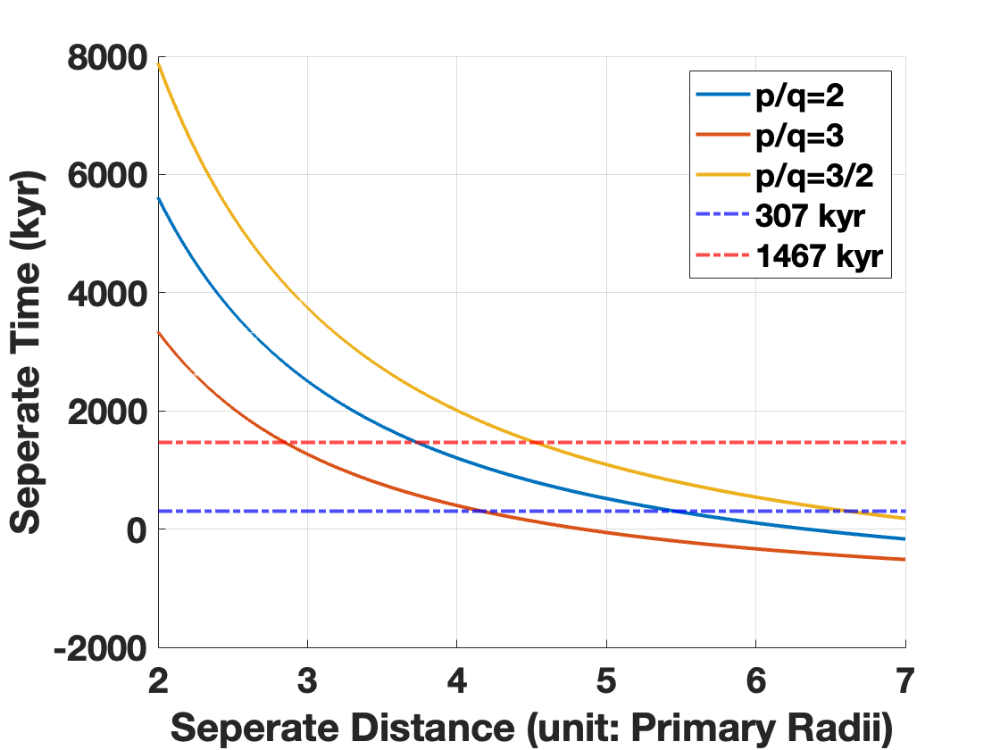
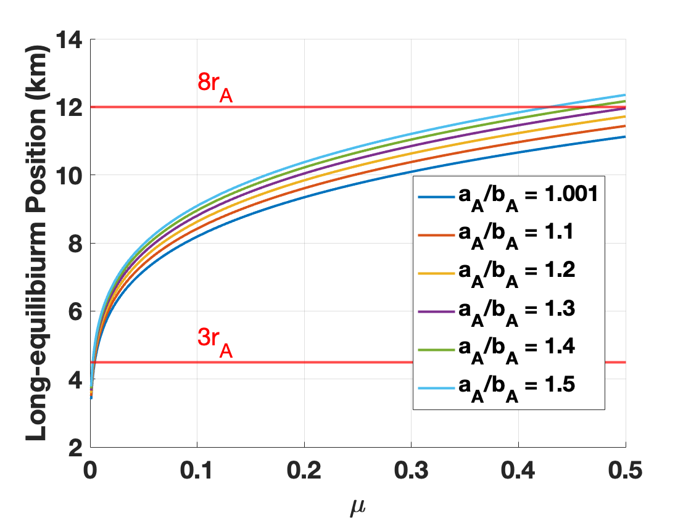

# Asteroid53537_formation_preinvestigation
We want to verify the formation of 53537-503955 pair. 

## Preinvestigation Version 5.0

Primary rotation period currently: $P_{r1} = 72.74~hour$;

Primary rotation period at seperation: $P_{r2} = jP_a$; 

Evolution Time from seperation about 307~1467 kyrs;

Ratio of primary and orbit rotation: $j = \omega_A/n = 2,3$;

Mutual Orbit Period $(P_a)$ at seperate time is a function of mutual distance $(R)$: $P_a = \sqrt{\frac{4\pi^2R^3}{Gm_A}}$;

Yorp effect adoptes the expression in [(Rossi et al 2009)](https://www.sciencedirect.com/science/article/pii/S0019103509001109): $\tau_Y = \dot{\omega}=\frac{B_s F_s r_A}{a_s^2 \sqrt{1-e_s^2} ma} C_{\mathrm{Y}}$, in which $B_s = 2/3,F_s = 1\times10^{17} ~ kg~m/s^2$, and $a_s = 2.45 ~ AU,e_s = 0.079, C_{\mathrm{Y}} = 0.025$;

Based on the Yorp torque and primary;s rotation period at current time and speration time, we can estimate the evolution time after seperation:
$$T(j,R) = \frac{\frac{2 \pi}{P_{r 2}}-\frac{2 \pi}{P_{r 1}}}{\tau_Y} = \frac{1}{j\tau_Y}\sqrt{\frac{Gm_A}{R^3}} - \frac{2\pi}{P_{r1}\tau_Y}$$

Considering the Yorp torque is a constant, the envolution time is a function of $j$ and $R$.

## InitialPosition Version 1.0
This sub-code aims to study the initial speration position w.r.t shape and ratio of mass. **Meanwhile, the expression typo of Long-term equilibrium in [(Wang et al 2021)](https://academic.oup.com/mnras/article-abstract/505/4/6037/6291199?redirectedFrom=fulltext&login=false) is corrected here.**

The tidal and BYORP torques are
$$\Gamma^{tid}_A = \frac{3}{2}\frac{k_2^A}{Q_A}\frac{\mu_B}{r^6}(\frac{a_A}{[L]})^5$$

$$\Gamma_{BY} = \frac{rF_sB_s\pi}{a_s^2\sqrt{1-e_s^2}} \frac{r_B^2}{[L]^2}f_{BY}$$
At the Long-term equilibrium position, these two torques are euqal

$$\Gamma^{tid}_A = \Gamma_{BY} \Rightarrow r^7 = \frac{3}{2}\frac{k_2^A}{Q_A}\frac{\mu_B^2a_s^2\sqrt{1-e_s^2}}{F_sB_s\pi\alpha_B^2}(\frac{a_A}{[L]})^5$$

in which, we have to note that $\alpha_B = r_B/[L]$ that is related to the secondary's radii $r_B$ and $a_A$ is the primary's longest semi-axis. Hence, the position of long-term equilibrium is just the function of secondary's size and primary's shape. 

These parameters of 53537-503955 pair are listed in below:
$$r_A = 1500 m, \frac{k_2^A}{Q_A} = 6\times10^5 \frac{r_A}{1\times 10^3 m}, a_s = 2.449111518894087 AU, \\
e_s = 0.07949126748318633, F_s = 1\times10^7 kg m/s^2,B_s = \frac{2}{3}, f_{BY} = 0.01, [L] = a_A + a_B$$

Then we iterate the mass ratio $\mu_B = [0, 0.5]$ and primary's shape $a_A/a_B = [1,1.5]$, the positions can be computed from every combination of mass ratio and primary's shape. Results are shown in following figure,

